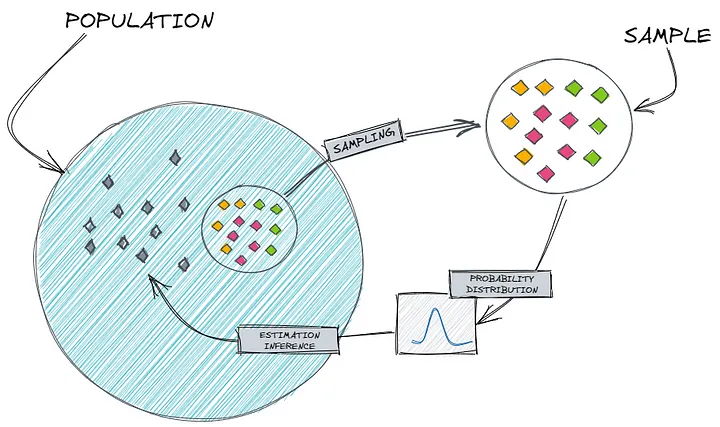
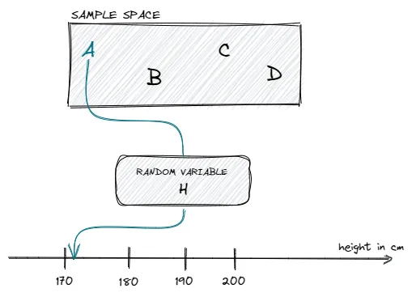
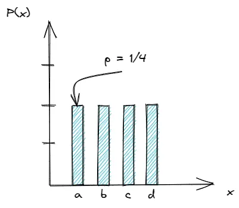
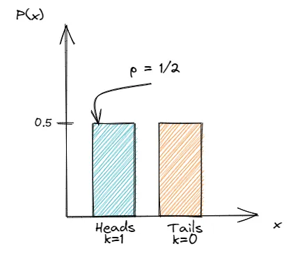
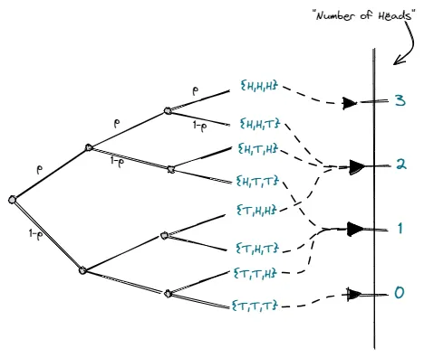
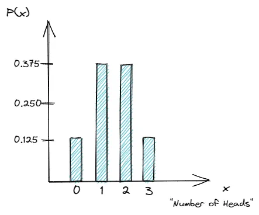
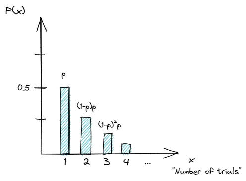
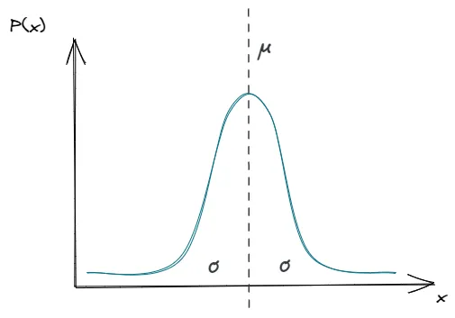
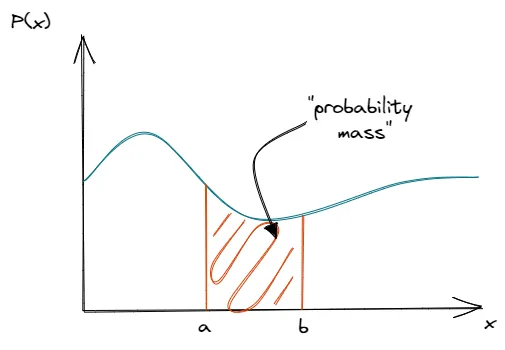

The subject of probability theory is the foundation upon which all of statistics is built, providing a means for modelling population, experiments or almost anything else that could be considered a random phenomenon. Through these models, statisticians are able to draw inferences about populations, inferences based on examination of only a part of the whole.

# Introduction to Probability Theory

Probability theory is a branch of mathematics concerned with the study of random phenomena and is often considered one of the fundamental pillars of machine learning. It is however a huge field to cover and very easy to get lost in, especially when being self-taught.

In the following sections, we are going to cover some fundamental aspects of probability before delving into aspects that are especially relevant to machine learning --- the random variable and the probability distribution.

## Set Theory

The set $S$ of all possible outcomes of a particular experiment is called the sample space for the experiment. If the experiment consists of tossing a coin, the sample space contains two outcomes, heads and tails: thus,

$$
S = \{H, T\}
$$

If, on the other hand, the experiment consists of observing the reported SAT scores of randomly selected students at a certain university, the sample space would be the set of positive integers between 200 and 800 that are multiples of ten --- that is, $S = \{200, 210, 220, ..., 780, 790, 800 \}$

We can classify sample spaces into two types according to the number of elements they contain. Sample spaces can be either **countable** or **uncountable**; If the elements of a sample space can be put into 1-1 correspondence with a subset of the integers, the sample space is countable. Of course, if the sample space contains only a finite number of elements, it is countable. Thus, the coin toss and SAT score sample is uncountable, since the positive real numbers cannot be put into 1-1 correspondence with the integers. If, however, we measured the reaction time to the nearest second, then the sample space would be (in seconds) $S = \{0, 1, 2, 3, ... \}$, which is then countable.

## Events

An event is any collection of possible outcomes of an experiment that is, any subset of $S$ (including $S$ itself)

Let A be an event, a subset of S. We say the event A occurs if the outcome of the experiment is the set A. When speaking of probabilities, we generally speak of the probability of an event, rather than a set. But we may use the terms interchangeably.

Given any two events (or sets) A and B, we have the following elementary set operations.

**Union**: The union of A and B, written $A\cup B$ is the set of elements that belong to either A or B or both

$$
A \cup B = \{x:x \in A \ or \ x \in B \}
$$

**Intersection:** The intersection of A and B, written $A\cap B$ is the set of elements that belong to both A and B

$$
A \cap B = \{x:x \in A \ and \ x \in B\}
$$

**Complementation:** The complement of A, written $A^c$, is the set of all elements that are not in A

$$
A^c = \{x:x \not\in A\}
$$

Elementary set operations can be combined, somewhat akin to the way addition and multiplication can be combined. As long as we are careful, we can treat sets as if they were numbers. We can now state the following useful properties of set operations.

1.  Commutativity.

    a\. $A\cup B = B \cup B$,

    b\. $A \cap B = B \cap A$

2.  Assocaiativity

    a\. $A \cup (B\cup C) = (A \cup B) \cup C$

    b\. $A \cap (B\cap C) = (A \cap B) \cap C$

3.  Distribution Laws

    a\. $A \cap (B \cup C) = (A \cap B) \cup (A \cap C)$

    b\. $A \cup (B\cap C) = (A \cup B) \cap (A \cup C)$

4.  DeMorgan's Laws

    a\. $(A \cup B )^C = A^C \cap B^C$

    b\. $(A \cap B )^C = A^C \cup B^C$

## Probability

Consider the simple experiment of tossing a fair coin, so $S = \{H, T\}$. By a "fair" coin we mean a balanced coin that is equally as likely to land heads up as tails up, and hence the reasonable probability function is the one that assigns equal probabilities to heads and tails, that is

$$
P(\{H\}) = P(\{T\})
$$

Since $S = \{H\} \cup \{T\}$, we have $P(\{H\} \cup \{T\}) = P(\{H\}) + P(\{T\})$ and

$$
P(\{H\}) + P(\{T\}) = 1
$$

Solving the equations simultaneously shows that $P(\{H\}) = P(\{T\}) = 1/2$

In machine learning, we often deal with uncertainty and stochastic quantities, due to one of the reasons being incomplete observability --- therefore, we most likely work with sampled data.

Now, suppose we want to draw reliable conclusions about the behavior of a random variable, despite the fact that we only have limited data and we simply do not know the entire population.

Hence, we need some kind of way to generalize from the sampled data to the population, or in other words --- we need to estimate the true data-generating process.



Understanding the probability distribution, allows us to compute the probability of a certain outcome by also accounting for the variability in the results. Thus, it enables us to generalize from the sample to the population, estimate the data-generating function and predict the behavior of a random variable more accurately.

# Random Variables

Loosely speaking, the random variable is a variable whose value depends on the outcome of a random event. We can also describe it as a function that maps from the sample space to a measurable space (e.g. a real number).

Let's assume, we have a sample space containing 4 students `{A, B, C, D}`. If we now randomly pick `student A` and measure the height in centimeters, we can think of the `random variable (H)`as the function with the input of `student`and the output of `height`as a real number.

$$
H(student) = height
$$

We can visualize this small example like the following



Depending on the outcome --- which student is randomly picked --- our random variable (H) can take on different states or different values in terms of height in centimeters.

A random variable can be either discrete or continuous.

If our random variable can take only a finite or countably infinite number of distinct values, then it is discrete. Examples of a discrete random variable include the number of students in a class, test questions answered correctly, the number of children in a family, etc.

Our random variable, however, is continuous if between any two values of our variable are an infinite number of other valid values. We can think of quantities such as pressure, height, mass, and distance as examples of continuous random variables.

When we couple our random variable with a probability distribution we can answer the following question: How likely is it for our random variable to take a specific state? Which is basically the same as asking for the probability.

Now, we are left with one question that remains--- what is a probability distribution?

# Probability Distribution

The description of how likely a random variable takes one of its possible states can be given by a probability distribution. Thus, the probability distribution is a mathematical function that gives the probabilities of different outcomes for an experiment.

More generally it can be described as the function

$$
P:A \rightarrow R
$$

which maps an input space A --- related to the sample space --- to a real number, namely the probability.

For the above function to characterize a probability distribution, it must follow all of the **Kolmogorov axioms:**

1.  **Non**-negativity

2.  No probability exceeds 1

3.  Additivity of any countable disjoint (mutually exclusive) events

The way we describe a probability distribution depends on whether the random variable is discrete or continuous, which will result in a probability mass or density function respectively.

## **Probability Mass Function**

The probability mass function (PMF) describes the probability distribution over a discrete random variable. In other terms, it is a function that returns the probability of a random variable being exactly equal to a specific value.

The returned probability lies in the range \[0, 1\] and the sum of all probabilities for every state equals one.

Let's imagine a plot where the x-axis describes the states and the y-axis shows the probability of a certain state. Thinking this way allows us to envision the probability or the PMF as a barplot sitting on top of a state.



In the following, we will learn about three common discrete probability distributions: The Bernoulli, binomial and geometric distribution.

### Bernoulli Distribution

Named after the Swiss mathematician Jacob Bernoulli, the Bernoulli distribution is a discrete probability distribution of a single binary random variable, which either takes the value 1 or 0.

Loosely speaking, we can think of the Bernoulli distribution as a model giving the set of possible outcomes for a single experiment, that can be answered with a simple yes-no question.

More formally the function can be stated as the following equation

$$
f(k;p) =     \begin{dcases}
        q = 1-p & if \ k = 0 \\
        q & if \ k = 1 \\
    \end{dcases}
$$

$$
f(k;p) = p^k(1-p)^{1-k} \ for \ k \in \{0,1\}
$$

which basically evaluates to `p if k=1` or to `(1-p) if k=0`. Thus, the Bernoulli distribution is parametrized by just a `single parameter p`.

Suppose, we toss a fair coin once. The probability of obtaining heads is `P(Heads) = 0.5`. Visualizing the PMF we get the following plot:



Since the Bernoulli Distribution models only a single trial, it can also be viewed as a special case of the binomial distribution

### Binomial Distribution

The binomial distribution describes the discrete probability distribution of the number of successes in a sequence of *n* independent trials, each with a binary outcome. The success or failure is given by the probability *p* or *(1-p)* respectively*.*

Thus, the binomial distribution is parametrized by the parameters

$$
n \in N, \ p \in [0,1]
$$

More formally the binomial distribution can be expressed with the following equation:

$$
f(k;n,p) = {n \choose k} p^k(1-p)^{n-k}
$$

The success of *k* is given by the probability *p* to the power of *k,* whereas the probability of failure is defined by *(1-p)* to the power of *n* minus *k*, which is basically the number of trials minus the one trial where we get *k*.

Since the event of success *k* can occur anywhere in *n* trials, we have ***"n choose k"*** ways to distribute the success.

Let's pick up our coin-tossing example from before and build on it.

Now, we are going to flip the fair coin three times, while being interested in the random variable describing the number of heads obtained.



If we want to compute the probability of the coin coming up as heads two times, we can simply use the equation from before and pluck in the values.

$$
P(2) = {3 \choose 2} p^2 (1-p)^{3-2}
$$

$$
P(2) = 3(0.5)^2(0.5)^1
$$

$$
P(2) = 0.375
$$

which results in a probability `P(2) = 0.375`. If we proceed in the same way for the remaining probabilities, we get the following distribution:



### Geometric Distribution

Suppose, we are interested in the number of times we have to flip a coin until it comes up heads for the first time.

The geometric distribution gives the probability of the first success occurrence, requiring *n* independent trials, with a success probability of *p*.

More formally it can be stated as

which computes the probability of the number of trials needed up to and including the success event.

The following assumptions need to be true, in order to calculate the geometric distribution:

1.  Independence

2.  For each trial, there are only two possible outcomes

3.  The probability of success is the same for every trial

Let's visualize the geometric distribution by answering the question for the probability of the number of trials needed for the coin to come up heads for the first time.



### Gaussian Distribution

The Gaussian distribution is often considered a sensible choice to represent a real-valued random variable, whose distribution is unknown.

This is mainly due to the central limit theorem, which, loosely speaking, states that the average of many independent random variables with finite mean and variance is itself a random variable --- which is normally distributed as the number of observations increases.

This is especially useful since it allows us to model complicated systems as Gaussian distributed, even if the individual parts follow a more complicated structure or distribution.

Another reason it is a common choice for modeling a distribution over a continuous variable is the fact that it inserts the least amount of prior knowledge.

More formally, the Gaussian distribution can be stated as

$$
N (x: \mu, \sigma^2) = \sqrt\frac{1}{2\pi\sigma^2}exp(-\frac{1}{2\sigma^2}(x-\mu)^2)
$$

where the parameter *µ* is the mean and *σ²* describes the variance.

In simple terms, the mean will be responsible for defining the central peak of the bell-shaped distribution, whereas the variance or the standard deviation defines its width.

We can visualize the normal distribution as the following:



## Probability Density Function

In the earlier sections, we learned that a random variable can either be discrete or continuous. If it is discrete, we can describe the probability distribution with a probability mass function.

Now, we are dealing with continuous variables --- hence, we need to describe the probability distribution with a probability density function (PDF).

The PDF, contrary to the PMF, does not give the probability of a random variable taking a specific state directly. Instead, it describes the probability of landing inside an infinitesimal region. In other terms, the PDF describes the probability of a random variable lying between a particular range of values.

In order to find the actual probability mass, we need to integrate, which yields the area under the density function but above the x-axis.



The probability density function must be non-negative and its integral needs to be 1.

$$
(1) \ \ p(x) \ge 0
$$

$$
(2) \ \ \int p(x) \delta x = 1
$$

One of the most common continuous probability distributions is the gaussian or normal distribution.

# Applications in Machine Learning

## Bayesian Inference

Bayesian inference is a way of making statistical inferences in which the statistician assigns subjective probabilities to the distributions that could generate the data. These subjective probabilities form the so-called prior distribution.

After the data is observed, [Bayes' rule](https://www.statlect.com/fundamentals-of-probability/Bayes-rule) is used to update the prior, that is, to revise the probabilities assigned to the possible data generating distributions. These revised probabilities form the so-called posterior distribution.

This lecture provides an introduction to Bayesian inference and discusses a simple example of inference about the mean of a normal distribution.

### **The likelihood**

The first building block of a parametric Bayesian model is the likelihood

The likelihood is equal to the probability density of x when the parameter of the data generating distribution is equal to $\theta$

For the time being, we assume that and are [continuous](https://www.statlect.com/glossary/absolutely-continuous-random-variable). Later, we will discuss how to relax this assumption.

### **The prior**

The second building block of a Bayesian model is the prior

$$
p(\theta)
$$

The prior is the subjective probability density assigned to the parameter

### **The posterior**

After observing the data , we use Bayes' rule to update the prior about the parameter :

The conditional density is called posterior distribution of the parameter.

By using the formula for the marginal density derived above, we obtain

Thus, the posterior depends on the two distributions specified by the statistician, the prior and the likelihood .

Example

```{python}
import numpy as np
import matplotlib.pyplot as plt
from scipy.stats import beta, binom

# Set up prior distribution
a = 0.5  # alpha parameter
b = 0.5  # beta parameter
prior = beta(a, b)  # create Beta distribution object

# Generate some fake data
n = 100  # number of trials
k = 40   # number of successes
data = binom.rvs(1, k/n, size=n)  # generate binary data from binomial distribution

# Compute posterior distribution
a_post = a + np.sum(data)  # update alpha parameter
b_post = b + n - np.sum(data)  # update beta parameter
posterior = beta(a_post, b_post)  # create updated Beta distribution object

# Compute credible intervals
CI_95 = beta.ppf([0.025, 0.975], a_post, b_post)  # compute 95% credible interval

# Plot prior and posterior distributions
x = np.linspace(0, 1, 1000)
prior_pdf = prior.pdf(x)
posterior_pdf = posterior.pdf(x)

plt.plot(x, prior_pdf, 'b--', linewidth=2)
plt.plot(x, posterior_pdf, 'r-', linewidth=2)
plt.ylim([0, max(posterior_pdf)*1.1])
plt.legend(['Prior', 'Posterior'])
plt.xlabel('p/(1-p)')
plt.ylabel('Density')
plt.title('Bayesian Analysis of p/(1-p)')
plt.show()

```

## Markov Chain Monte Carlo (MCMC)

There are several Bayesian models that allow us to compute the posterior distribution of the parameters analytically. However, this is often not possible.

When an analytical solution is not available, Markov Chain Monte Carlo (MCMC) methods are commonly employed to derive the posterior distribution numerically.

MCMC methods are [Monte Carlo methods](https://www.statlect.com/asymptotic-theory/Monte-Carlo-method) that allow us to generate large samples of correlated draws from the posterior distribution of the parameter vector by simply using the proportionality

The [empirical distribution](https://www.statlect.com/asymptotic-theory/empirical-distribution) of the generated sample can then be used to produce [plug-in estimates](https://www.statlect.com/asymptotic-theory/plug-in-principle) of the quantities of interest.

See the lecture on [MCMC methods](https://www.statlect.com/fundamentals-of-statistics/Markov-Chain-Monte-Carlo) for more details.

```{python}
import numpy as np
import matplotlib.pyplot as plt
from scipy.stats import norm

# Define the target distribution
def target_dist(x):
    return np.exp(-x**2 / 2) / np.sqrt(2 * np.pi)

# Define the proposal distribution (normal distribution)
def prop_dist(x, sigma):
    return np.random.normal(x, sigma)

# Set the initial state and other parameters
x0 = 0
num_samples = 10000
burn_in = 1000
sigma = 1

# Initialize the Markov chain
x = x0

# Generate samples using the Metropolis-Hastings algorithm
samples = np.zeros(num_samples)
for i in range(num_samples + burn_in):
    # Generate a proposal
    x_prop = prop_dist(x, sigma)

    # Compute the acceptance probability
    alpha = min(1, target_dist(x_prop) / target_dist(x))

    # Decide whether to accept the proposal
    if np.random.rand() < alpha:
        x = x_prop

    # Save the sample after the burn-in period
    if i > burn_in:
        samples[i - burn_in] = x

# Plot the histogram of the samples and the target distribution
plt.hist(samples, bins=30, density=True, alpha=0.5)
x_vals = np.linspace(-5, 5, 100)
plt.plot(x_vals, target_dist(x_vals), 'r-', linewidth=2)
plt.xlabel('x')
plt.ylabel('Probability density')
plt.legend(['Samples', 'Target distribution'])
plt.show()

```

Illustrations are obtained from here[^1]

[^1]: <https://towardsdatascience.com/>
