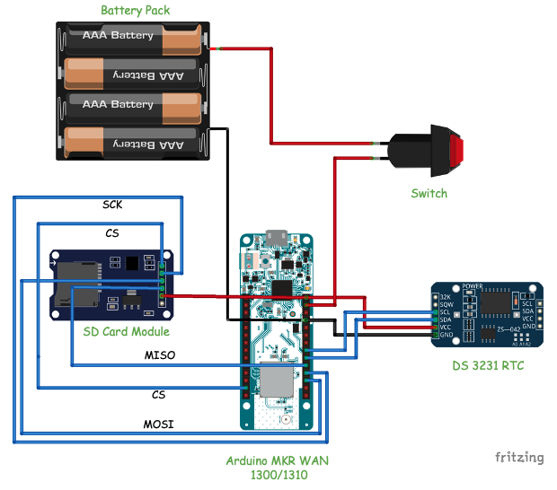
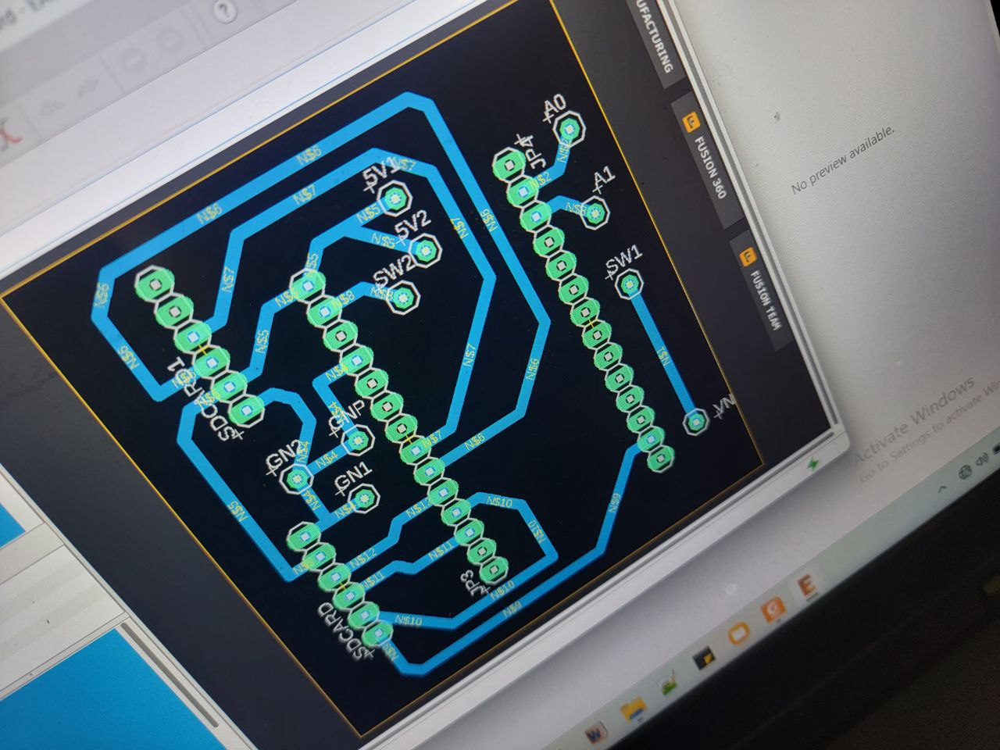
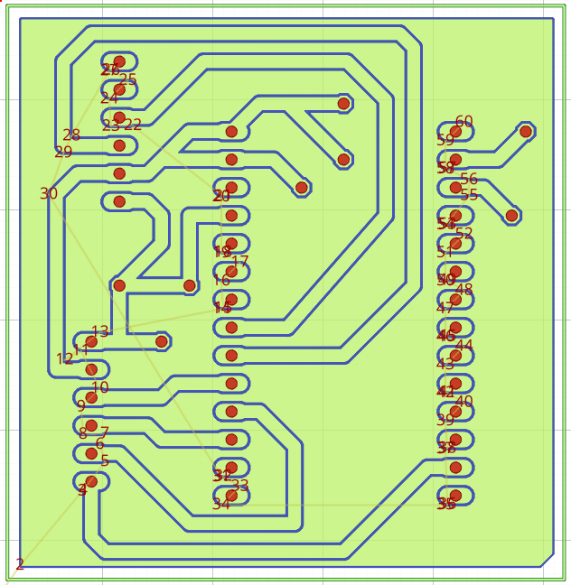
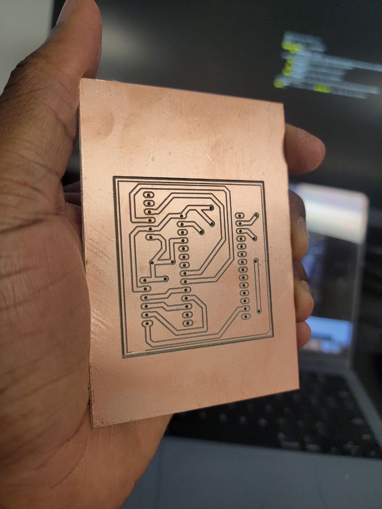
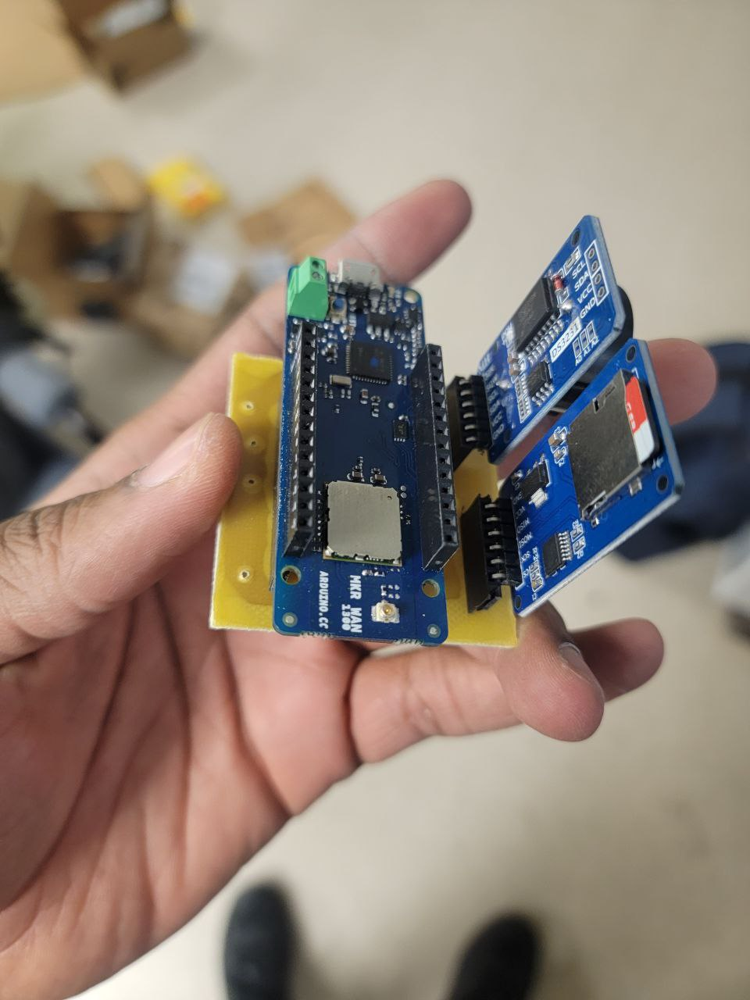
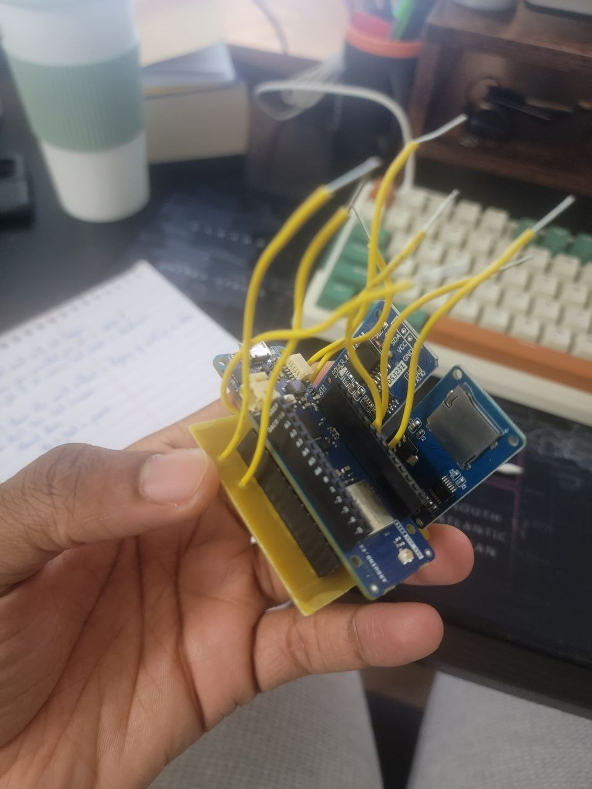
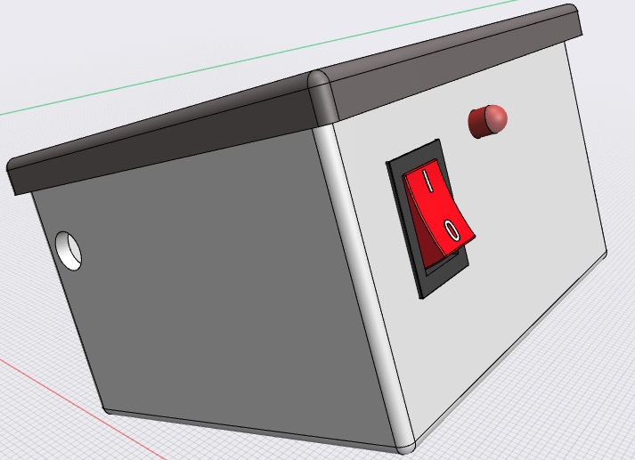
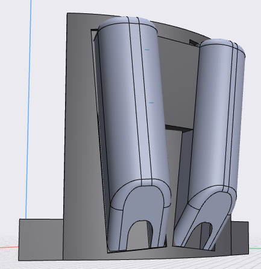
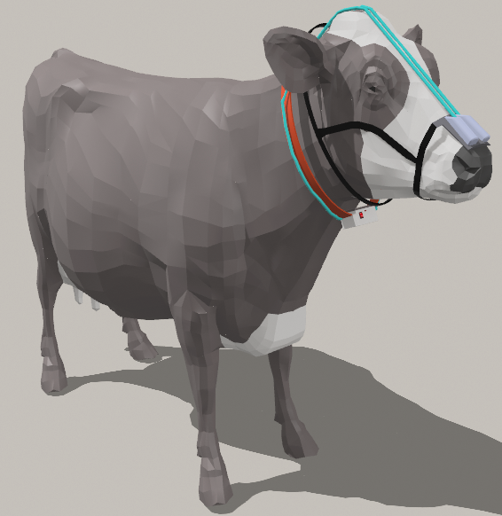

# Background 

Livestock farming, particularly the dairy and beef industries, plays a significant role in global agricultural economies, providing essential food products and livelihoods for millions worldwide. However, one of the most pressing challenges associated with this industry is the environmental impact of methane emissions from cattle. Methane, a potent greenhouse gas, contributes significantly to climate change, with livestock farming being a major source of its emission.

Addressing this challenge requires innovative solutions that not only minimize environmental harm but also ensure sustainable agricultural practices. In this context, the integration of embedded systems onto cattle harnesses presents a promising avenue for monitoring and mitigating methane emissions directly at the source.

This project aims to explore the development and implementation of such embedded systems, designed to accurately measure and analyze methane production in cattle. By harnessing cutting-edge technology, we seek to provide farmers with real-time data insights into their herd's methane emissions, enabling informed decision-making and targeted interventions to reduce environmental impact.

Through a combination of sensor technology, data processing algorithms, and wireless communication capabilities, these embedded systems offer a holistic approach to managing methane emissions from cattle. By collecting continuous, on-farm data, farmers can not only quantify methane output but also identify trends, patterns, and potential mitigation strategies tailored to their specific operation.

Moreover, by integrating these systems into existing cattle management practices, we aim to facilitate seamless adoption and integration within agricultural workflows. By empowering farmers with actionable information, we aspire to foster a more sustainable and environmentally conscious approach to livestock farming, contributing to global efforts towards mitigating climate change.

In this project, we delve into the design, development, and deployment of embedded systems mounted on cattle harnesses, outlining the technical specifications, data collection methodologies, and potential environmental impact assessments. Furthermore, we explore the practical implications and benefits of implementing such technology, both from an agricultural and environmental perspective.

Ultimately, this project seeks to showcase the transformative potential of harnessing innovation to address pressing environmental challenges, paving the way for a more sustainable future for livestock farming while simultaneously reducing its carbon footprint.

# System Design

The embedded system schematic for monitoring methane emissions from cattle comprises several key components seamlessly integrated to provide real-time data collection and storage capabilities. Here's a brief overview of the system components and their connections:

{fig-align="center"}

1.  **Arduino MKR 1300 or 1310**: The Arduino MKR board serves as the central processing unit for the system, responsible for interfacing with various sensors, processing data, and controlling operations. It offers low-power consumption and wireless connectivity, ideal for IoT applications.

2.  **DS3231 Real-Time Clock (RTC)**: The DS3231 RTC module provides accurate timekeeping functionality to the system, ensuring precise timestamping of sensor data. It communicates with the Arduino board via I2C protocol, maintaining time synchronization even in the absence of external power.

3.  **SD Card Module**: An SD card module is utilized to store sensor data along with corresponding timestamps. This module offers ample storage capacity and high data transfer rates, enabling efficient logging of methane concentration measurements over extended periods.

4.  **Battery and Switch**: A rechargeable battery is connected through a switch to the Vin pin of the Arduino board, providing portable power to the system. This setup ensures uninterrupted operation even in remote or off-grid environments, enhancing the system's versatility and reliability.

5.  **MQ-4 Methane Sensors**: Two MQ-4 methane sensors are interfaced with the Arduino board, connected to analog pins A0 and A1. These sensors utilize gas-sensitive elements to detect methane concentration levels in the surrounding environment. By deploying multiple sensors, the system can capture methane emissions from different locations or angles, enhancing spatial data accuracy.

The Arduino board orchestrates the operation of the entire system, periodically reading data from the methane sensors and RTC module. Upon acquiring sensor readings, the data, along with corresponding timestamps, are logged onto the SD card for further analysis or retrieval.

The above schematic is designed and routed in EAGLE[^1] to facilitatate the PCB manufacturing. A link to the EAGLE files used in this project is given here: <https://drive.google.com/file/d/1z2dAzGoUNg0i-8NJMZA5pk57xxp1MNmJ/view?usp=sharing>

[^1]: <https://www.autodesk.com/products/eagle/overview?term=1-YEAR&tab=subscription>

{fig-align="center" width="747"}

Next, the Gerber files generated with EAGLE is converted to gcode files for the CNC milling machine[^2] using FlatCAM software[^3]

[^2]: <https://www.amazon.com/Genmitsu-3018-PRO-Control-Engraving-300x180x45mm/dp/B07P6K9BL3/ref=sr_1_2?crid=ABP8AW6UFFJZ&dib=eyJ2IjoiMSJ9.RQe4Zy_YwT7FX77Pi84YHfpnpPzLOXpRzN6afBecVLyxXE375zZGGxcMFCqg1zuVU2RDn4lQFy3fNWO8GgK-B6041GOOirkfZasJF5fktYwDA48EtPQdgr7r21HFIT4yeUyl_6afOFq6e9Z0DV9mQH8jQSo6__Vdkev8yUM3k_4kvLTqFyVCIWfkgCxYgDe7FkkZ_rKe8yOu905LsJvw3E_7xLHDC6dm3XdL9UZ5ZnQglBcg4ElKnvg8UZ85HoJHRiKrxdO7aeOleZcKXH76VVnJH7C3RG4yqOwnM-GLg3Q.tlKlfveEvYPqQKrLehs1bphEMdOdVaPrjo9N1SxkjXE&dib_tag=se&keywords=pcb%2Bmachine&qid=1710270710&sprefix=pcb%2Bmachine%2Caps%2C96&sr=8-2&th=1>

[^3]: <http://flatcam.org/download>

{fig-align="center"}

A video of the milling process is shown below:


The Final printed circuit board is shown below:

{fig-align="center" width="375"}

The Arduino MKR WAN 1300, real time clock and SD card reader are mounted on the board:

{fig-align="center" width="375"}

Jumper wired required for connecting the MQ4 sensors, battery pack and switch are now soldered on the board

{fig-align="center" width="375"}

This code below the sensors and modules to monitor methane gas levels, log data to an SD card, and timestamp the readings using a real-time clock (RTC). It utilizes the SPI communication protocol for peripherals like the LoRa module and the SD card reader. The LoRa module, though currently commented out, facilitates wireless communication. The main loop continuously reads methane gas levels from two MQ4 gas sensors, applies a Kalman filter for noise reduction, and saves the data along with timestamps to an SD card. Additionally, it prints the readings and timestamps to the serial monitor. The code employs the DS3231 library for RTC functionalities and defines pins for sensors and modules. The getMethanePPM functions calculate gas concentration based on sensor readings, while the KALMAN function implements the Kalman filter algorithm.

``` cpp
include <SPI.h>
#include <LoRa.h>
#include <SD.h>
#include <DS3231.h>
#include <Wire.h>

const byte MQ4_Pin = A0;
const int R_O = 945;

#define SS_PIN 4
#define RST_PIN 9
#define DI0_PIN 2

#define LEDPIN 1

File myFile;

DS3231 myRTC;
bool century = false;
bool h12Flag;
bool pmFlag;

void setup() {
  // put your setup code here, to run once:
  pinMode(LEDPIN, OUTPUT);
  Serial.begin(9600); 
  Wire.begin();

  //while (!Serial);  

/*
  if (!LoRa.begin(915E6)) {
    Serial.println("Starting LoRa failed!");
    while (1);
  } 
*/

  if (!SD.begin(SS_PIN)) {
    Serial.println("Starting SD card failed!");
    while (1);
  }
  Serial.println("SD card initialized.");

}

void loop() {
  digitalWrite(LEDPIN, HIGH);
  Serial.println(getMethanePPM2());
  Serial.println(getMethanePPM());
  
  int yr = myRTC.getYear();
  int mon = myRTC.getMonth(century);
  int dy = myRTC.getDate();

  int hrs = myRTC.getHour(h12Flag, pmFlag);
  int mts = myRTC.getMinute();
  int sec = myRTC.getSecond();

  String currentTime = String(hrs) + ":" + String(mts) + ":" + String(sec) + "/" + String(yr) + "-" + String(mon) + "-" + String(dy);
  Serial.println(currentTime);
  
  
  /*Serial.println(" ");
  LoRa.beginPacket();
  LoRa.print((float)max(getMethanePPM(), getMethanePPM2()));
  LoRa.print(", ");
  LoRa.print(currentTime);
  LoRa.endPacket();
 */
  
  myFile = SD.open("data.txt", FILE_WRITE);
  if (myFile) {
    //myFile.print((float)max(getMethanePPM(), getMethanePPM2()));
    myFile.print((float)getMethanePPM());
    myFile.print(", ");
    myFile.print((float)getMethanePPM2());
    myFile.print(", ");
    myFile.print(currentTime);
    myFile.print(", ");
    myFile.println(LoRa.packetRssi());
    //delay(500);
    myFile.close();
    Serial.println("Data saved to SD card.");
    digitalWrite(LEDPIN, LOW);
  } else {
    Serial.println("Error opening data.txt");
  }
  
  delay(1000);

}

float getMethanePPM(){
  float a0 = analogRead(A0); //get raw reading from sensor
  float v_o = a0 * 5 / 1023; //convert reading to volts
  float R_S = (5-v_o) * 1000 / v_o; //apply formula for getting RS
  float PPM = pow(R_S/R_O, -2.95) * 1000; //apply formula for getting PPM
  float PPM2 = KALMAN(PPM)*2;
  return PPM2; //return PPM value to calling function  
}

float getMethanePPM2(){
  float a0 = analogRead(A1); //get raw reading from sensor
  float v_o = a0 * 5 / 1023; //convert reading to volts
  float R_S = (5-v_o) * 1000 / v_o; //apply formula for getting RS
  float PPM = pow(R_S/R_O, -2.95) * 1000; //apply formula for getting PPM
  float PPM2 = KALMAN(PPM)*2;
  return PPM2; //return PPM value to calling function  
}

float KALMAN (float U){                                              
  static const float R = 0.33; //noise covariance
  static const float H = 1.00; //measurement map
  //at k = 0 we have these initial condidtions
  //i.e before simulations starts
  static float Q = 15; //initial covariance of estimated
  static float P = 0; //initial error covariance
  static float U_hat = 0; //initial estimated state
  static float K = 0; //initial kalman Gain
  //so U comes in, start the KF process
  K = P*H/(H*P*H+R); //Kalman gain
  U_hat = U_hat+ K*(U-H*U_hat);
  //Update error covariance and project it ahead
  P = (1-K*H)*P + Q;
  return U_hat; 
}

//source code can be found below
//https://www.utmel.com/components/how-to-use-mq4-gas-sensor?id=821
//I do not not claim ownership of this code #copyright 10-03-2023
```

The 3D model of the box housing the arduino and other components is shown below:

{fig-align="center" width="414"}

The mask housing the methane sensors is shown below:

{fig-align="center"}

Finally, the overall system setup is shown below:

{fig-align="center"}

A link for 3D visualtion: <https://collaborate.shapr3d.com/v/pm4wyNe9QLAsHzlwYDE5A>
