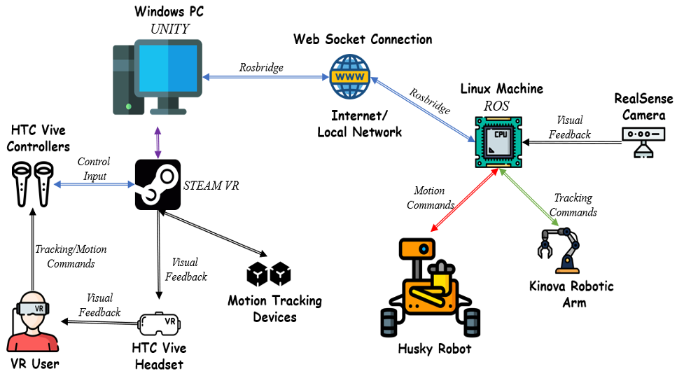
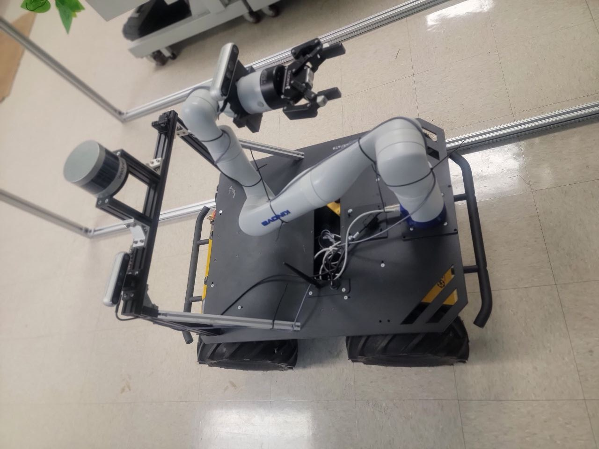

# Background

The agricultural industry is undergoing a technological revolution driven by automation and robotics. With the rising demand for efficient and sustainable farming practices, there is a growing need for advanced solutions that can address challenges such as labor shortages, increasing production demands, and resource optimization. In this context, the integration of robotics and virtual reality (VR) technologies presents a promising avenue for enhancing agricultural operations.

The project focuses on the development and implementation of a cutting-edge system that combines a Husky Unmanned Ground Vehicle (UGV) and a Kinova Gen3 robotic arm, controlled through immersive virtual reality interfaces. The Husky UGV, renowned for its ruggedness, versatility, and mobility, serves as the mobile platform for navigating through agricultural environments, while the Kinova Gen3 arm provides dexterity and precision for performing various tasks such as fruit harvesting and crop inspection.

The utilization of virtual reality technology enables operators to teleoperate the Husky UGV and manipulate the Kinova Gen3 arm from a remote location with an unprecedented level of immersion and control. By donning VR headsets and motion-tracking controllers, operators can visualize the agricultural environment in real-time, interact with the robotic system, and execute complex maneuvers with intuitive gestures.

Key Objectives:

1.  **Enhanced Mobility and Manipulation**: The integration of the Husky UGV and Kinova Gen3 arm aims to provide a versatile platform capable of navigating challenging terrain and performing intricate tasks with agility and precision. By combining mobility with manipulation capabilities, the system can effectively adapt to diverse agricultural environments and address a wide range of tasks, including fruit harvesting, crop monitoring, and precision spraying.

2.  **Improved Efficiency and Productivity**: By automating labor-intensive tasks and reducing reliance on manual labor, the proposed system seeks to enhance operational efficiency and productivity in agricultural operations. The seamless integration of robotics and VR technology enables operators to remotely supervise and control the robotic system with enhanced situational awareness, leading to optimized workflows and resource utilization.

3.  **Minimized Environmental Impact**: With a focus on sustainability, the project aims to minimize the environmental impact of agricultural practices by promoting precision agriculture and targeted interventions. By leveraging robotics for precise task execution and data collection, farmers can optimize inputs such as water, fertilizers, and pesticides, thereby reducing waste and minimizing environmental degradation.

4.  **Scalability and Adaptability**: The developed system is designed to be scalable and adaptable to different agricultural settings and tasks. Whether deployed in orchards, vineyards, or open fields, the modular architecture of the system allows for easy customization and integration of additional sensors or peripherals to meet specific requirements and challenges encountered in various agricultural contexts.

Overall, the project seeks to demonstrate the feasibility and potential of teleoperating a Husky UGV and Kinova Gen3 arm with VR technology for agricultural applications, paving the way for the adoption of advanced robotics solutions to address the evolving needs of the agricultural industry. Through collaboration with stakeholders and field trials in real-world agricultural settings, the project aims to validate the effectiveness, reliability, and economic viability of the proposed system, ultimately contributing to the advancement of sustainable and efficient farming practices.

# System Design

{fig-align="center"}

1.  **Windows PC running Unity Engine:**
    The Windows PC serves as the central computing unit responsible for running the Unity Engine, a powerful and versatile game development platform. Unity provides the framework for creating immersive virtual reality experiences and interfaces for controlling the robotic system. It handles tasks such as rendering 3D environments, managing input from VR controllers and headsets, and interfacing with other components of the system.

2.  **HTC Vive VR Controllers, Headset, and Motion Tracking Devices:**
    The HTC Vive VR system consists of handheld controllers, a high-resolution headset, and motion tracking devices known as base stations. The controllers allow users to interact with virtual objects and environments with natural hand movements and gestures. The headset provides a fully immersive VR experience, transporting users to virtual agricultural environments in real-time. The motion tracking devices ensure accurate spatial tracking, enabling seamless integration of physical and virtual spaces.

3.  **Linux Machine running ROS (Robot Operating System):**
    The Linux machine serves as the primary control system for the robotic components, running the Robot Operating System (ROS). ROS is a flexible framework for building robotic systems, offering tools and libraries for managing hardware abstraction, communication between components, and high-level functionality such as navigation and manipulation. It provides the infrastructure for interfacing with sensors, controlling actuators, and orchestrating complex behaviors within the robotic system.

4.  **Husky UGV (Unmanned Ground Vehicle):**
    The Husky UGV is a rugged and versatile mobile platform designed for outdoor environments. Equipped with all-terrain wheels, robust suspension, and powerful motors, the Husky UGV can navigate challenging terrain with ease. It serves as the base platform for transporting the Kinova Gen3 arm and the RealSense camera to various locations within agricultural settings, enabling remote operation and task execution.

5.  **Kinova Gen3 Arm:**
    The Kinova Gen3 arm is a state-of-the-art robotic manipulator renowned for its dexterity, precision, and versatility. Featuring multiple degrees of freedom, advanced joint designs, and integrated sensors, the Gen3 arm is capable of performing a wide range of manipulation tasks with exceptional accuracy and efficiency. It serves as the primary tool for tasks such as fruit harvesting, crop inspection, and precision spraying within agricultural environments.

6.  **RealSense Camera:**
    The RealSense camera is a depth-sensing RGB-D camera developed by Intel. It provides depth perception and spatial awareness, allowing the robotic system to perceive and interact with its surroundings in three dimensions. The RealSense camera serves as a vital sensory component for tasks such as obstacle avoidance, object recognition, and environmental mapping within agricultural environments, enhancing the autonomy and intelligence of the robotic system.

Together, these components form an integrated system for teleoperating a Husky UGV and Kinova Gen3 arm with VR technology, enabling immersive control and execution of agricultural tasks such as fruit harvesting and crop inspection with enhanced efficiency, precision, and adaptability.

{fig-align="center" width="60%"}

# To Be Continued ...
